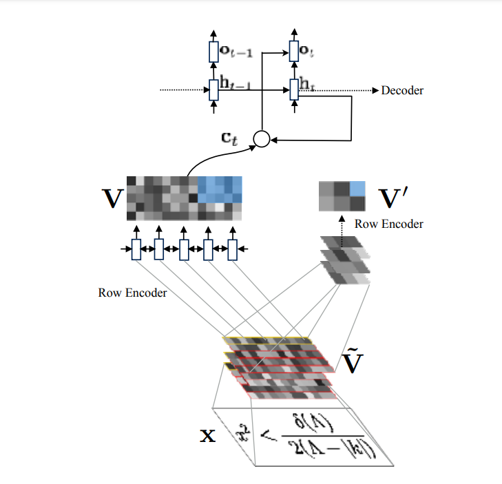

# LatexGen
Converts images to Latex code!

## Introduction

### Image to Markup

This is a project to convert images of mathematical equations to latex markup. The project is based on the paper [Image to Latex](https://arxiv.org/abs/1609.04938) by the team at Stanford. The paper uses a CNN encoder and an LSTM decoder to convert images to latex markup. The paper uses a custom dataset of 400k images of mathematical equations. I'm using dataset from [latex.codecogs](https://latex.codecogs.com/) with 100k annotated images similar to the 100k dataset used in the paper.

[More](https://im2markup.yuntiandeng.com/) about the paper can be found here

## Architecture

- Uses a CNN encoder to encode the image into a feature vector
- Uses an LSTM decoder to decode the feature vector into latex markup
- Uses a beam search algorithm to find the best possible sequence of latex markup
- Uses a custom loss function to train the model
- Uses a custom dataset of 100k images of mathematical equations

For more info, refer to the jupyter notebooks
